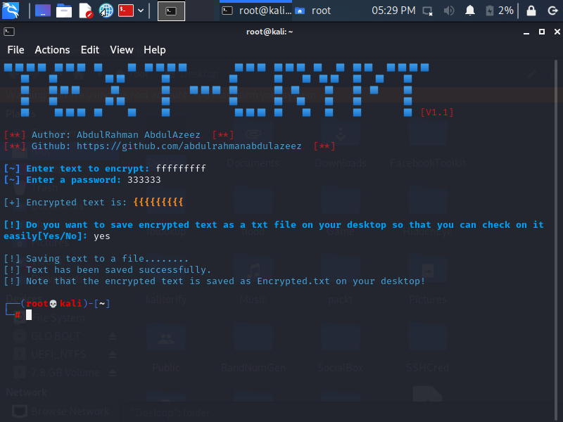
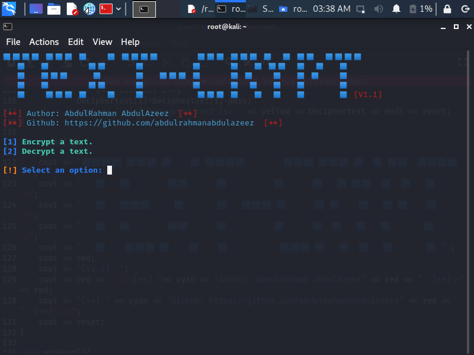
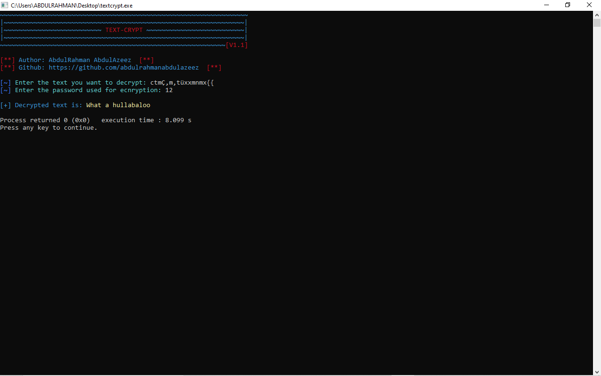
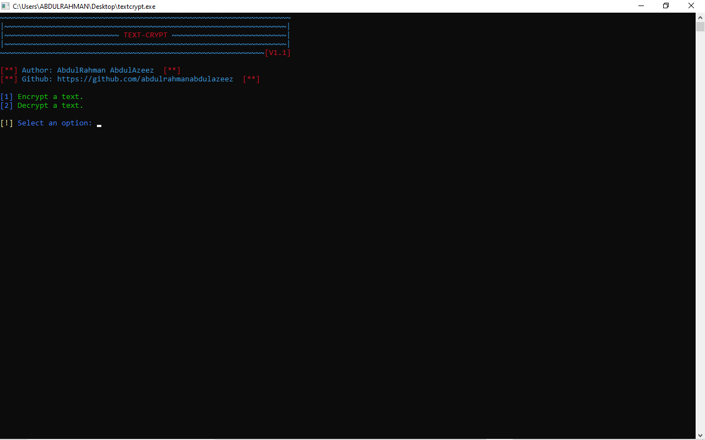

# TEXT-CRYPT
```
Text-Crypt is a tool which uses Caesar Cypher Algorithm to 
encrypt and decrypt a text.
The text is encrypted using a key provided by the user and also 
decrypted using the same key the user provided for the text's encryption.
```

# Platform(s)
* Windows  ✅
* Linux    ✅

# Requirement
* GCC Compiler

# Features
* Encryption
* Decryption
* Writing encrypted text(s) to a file.

# Installation
``` 
git clone https://github.com/abdulrahmanabdulazeez/textcrypt.git
cd textcrypt
g++ textcrypt.cpp -o textcrypt
./textcrypt
```

# Screenshots






